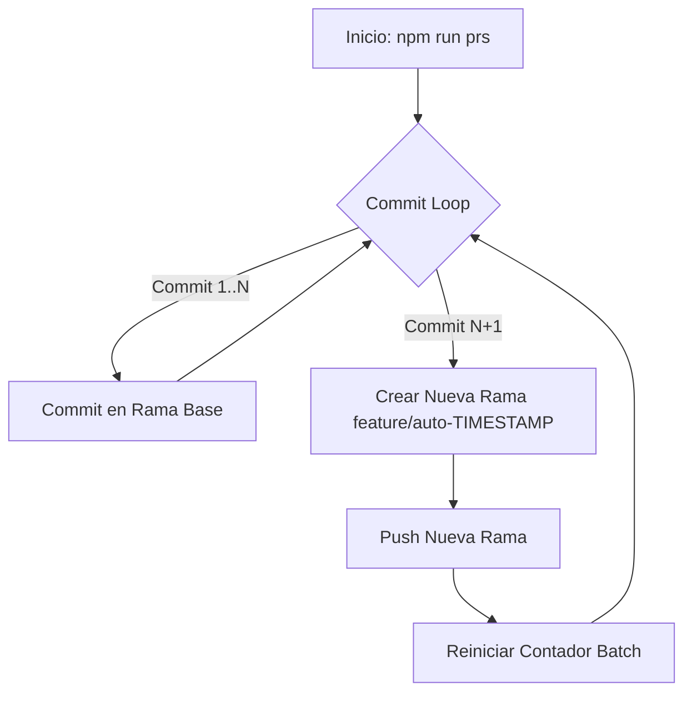

# node-commits 🚀

**Automatización de actividad en Git: Commits periódicos y creación dinámica de ramas con Node.js.**

Esta herramienta permite simular actividad en un repositorio Git mediante commits automatizados y estrategias de branching configurables. Incluye soporte para autenticación segura mediante variables de entorno.

## 📋 Descripción

`node-commits` es una suite de herramientas diseñada para generar actividad automatizada en repositorios de Git. Es ideal para:

- Validar configuraciones de CI/CD (GitHub Actions, Jenkins, etc.).
- Probar scripts de integración y webhooks.
- Mantener flujos de trabajo activos para pruebas de carga.

### Temas (Topics)

`git-automation`, `nodejs`, `github-activity`, `ci-cd-test`, `git-scripts`

## 🧩 Flujo de Trabajo (Diagrama)

El siguiente diagrama ilustra el flujo lógico del script de automatización intensiva (`npm run prs`):



_Nota: **N** es el tamaño del lote configurado mediante `GIT_PRS_BATCH`._

## 📂 Estructura del Proyecto

```text
node-commits/
├── data/           # Archivos generados durante la automatización
│   └── document.txt
├── src/            # Código fuente
│   ├── index.js    # Script de intervalo regular (ej: cada 2h)
│   ├── prs.js      # Script de flujo intensivo (commits + branching)
│   └── utils.js    # Utilidades y configuración de git
├── tests/          # Tests automatizados (Jest)
├── package.json    # Configuración y scripts
└── README.md       # Este archivo
```

## 🛠️ Instalación y Configuración

1.  **Clonar**:
    ```bash
    git clone <url-repo>
    cd node-commits
    ```
2.  **Instalar dependencias**:
    ```bash
    npm install
    ```
3.  **Configurar Variables de Entorno**:
    Crea un archivo `.env` basado en el ejemplo:
    ```bash
    cp .env.example .env
    ```

### Variables de Configuración

| Variable               | Descripción                                        | Default        |
| :--------------------- | :------------------------------------------------- | :------------- |
| `GITHUB_TOKEN`         | Personal Access Token (necesario para HTTPS auth). | -              |
| `GITHUB_USERNAME`      | Tu usuario de GitHub.                              | -              |
| `GIT_REPO_URL`         | URL HTTPS explícita del repositorio.               | `origin` url   |
| `GIT_COMMITTER_NAME`   | Nombre para autoría de commits.                    | System config  |
| `GIT_COMMITTER_EMAIL`  | Email para autoría de commits.                     | System config  |
| `GIT_REGULAR_INTERVAL` | Intervalo ms para `npm start`.                     | `7200000` (2h) |
| `GIT_INTERVAL`         | Intervalo ms para `npm run prs`.                   | `5000` (5s)    |
| `GIT_PRS_BATCH`        | Commits antes de crear rama nueva.                 | `10`           |
| `GIT_BASE_BRANCH`      | Rama base para nuevos features.                    | `main`         |

## 🕹️ Modos de Uso

### 1. Modo Regular (`npm start`)

Ideal para mantenimiento de actividad constante a largo plazo.

- **Acción**: Realiza un commit en el archivo `data/document.txt` y hace push a la rama actual.
- **Frecuencia**: Cada 2 horas (configurable con `GIT_REGULAR_INTERVAL`).

### 2. Modo Intensivo (`npm run prs`)

Simula un desarrollador trabajando activamente en features.

- **Acción**:
  1.  Genera commits rápidos (cada 5s por defecto).
  2.  Cada **10 commits** (configurable con `GIT_PRS_BATCH`), crea una rama nueva `feature/auto-<timestamp>`.
  3.  Hace push de la nueva rama al remoto.
  4.  Vuelve a la rama base (`main`) y repite.

**Ejemplo de salida en consola:**

```text
[START]: Iniciando automatización intensiva cada 5000ms (Batch: 10, Base: main)
[INFO]: Archivo modificado en .../data/document.txt
[SUCCESS]: Commit #1 guardado.
...
[SUCCESS]: Commit #10 guardado.
[FLOW]: Iniciando nueva rama desde main
[SUCCESS]: Rama creada: feature/auto-1707123456789
[SUCCESS]: Empujado a branch feature/auto-1707123456789
```

## 🧪 Testing

Este proyecto incluye tests unitarios con **Jest** para validar la lógica de automatización y la configuración de git sin ejecutar comandos reales.

```bash
npm test
```

---

> 🚨 **PRECAUCIÓN**: Ten en cuenta que el uso excesivo de scripts de automatización puede generar una gran cantidad de datos en tu historial de git. **Úsalo con responsabilidad.**
